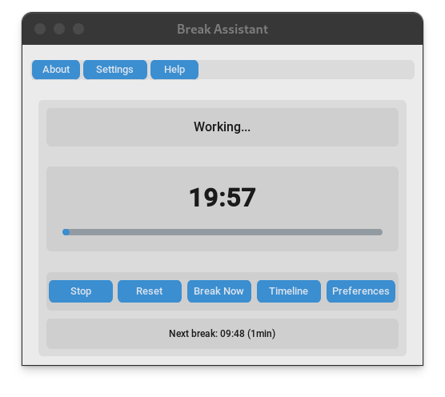
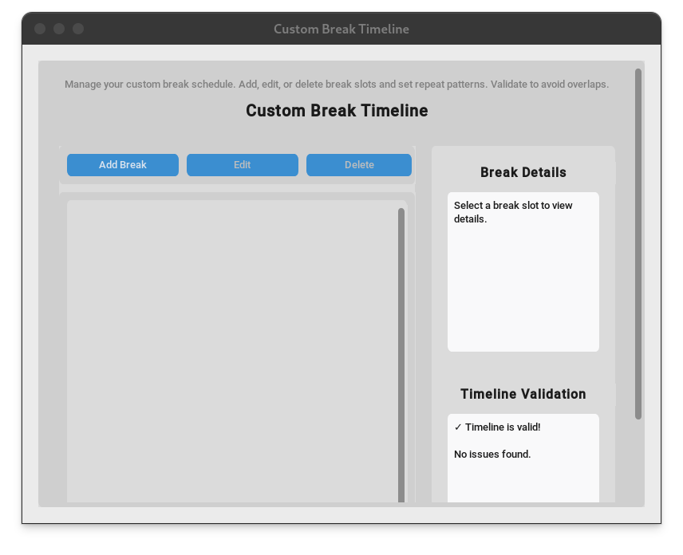
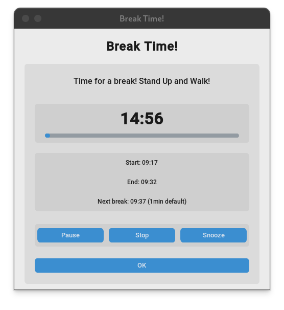

# Break Assistant User Manual

## Table of Contents

1. [Introduction](#introduction)
2. [Getting Started](#getting-started)
3. [Main Interface](#main-interface)
4. [Timeline Management](#timeline-management)
5. [Settings Configuration](#settings-configuration)
6. [Advanced Features](#advanced-features)
7. [Troubleshooting](#troubleshooting)
8. [Keyboard Shortcuts](#keyboard-shortcuts)
9. [FAQ](#faq)

## Introduction

Break Assistant is a sophisticated break reminder application designed to help you maintain healthy work habits. Unlike simple timers, Break Assistant offers advanced timeline-based scheduling that adapts to your daily routine.

### Key Benefits

- **Smart Scheduling**: Define multiple break times throughout your day
- **Flexible Patterns**: Set breaks for daily, weekdays, weekends, or one-time events
- **Visual Management**: Easy-to-use timeline interface for managing your schedule
- **Customizable Alerts**: Choose your preferred notification sounds and themes
- **Cross-Platform**: Works seamlessly on Linux, Windows, and macOS

## Getting Started

### Installation

#### Linux Users
1. Download the AppImage file from the releases page
2. Make it executable: `chmod +x Break-Assistant-1.0.0-x86_64.AppImage`
3. Run the application: `./Break-Assistant-1.0.0-x86_64.AppImage`

#### Windows Users
1. **Download**: Get the Windows executable from the releases page
   - `Break-Assistant-1.0.0.exe` (standalone executable)
   - `Break-Assistant-1.0.0.msi` (installer package)

2. **Installation Options**:
   - **Executable**: Double-click `Break-Assistant-1.0.0.exe` to run directly
   - **Installer**: Run `msiexec /i Break-Assistant-1.0.0.msi` for system installation

3. **Launch**: Start Break Assistant from the Start menu or desktop shortcut

#### macOS Users
1. **Download**: Get the macOS package from the releases page
   - `Break Assistant.app` (app bundle)
   - `Break-Assistant-1.0.0.dmg` (installer disk image)

2. **Installation Options**:
   - **App Bundle**: Drag `Break Assistant.app` to Applications folder
   - **DMG**: Double-click `Break-Assistant-1.0.0.dmg`, then drag to Applications

3. **Launch**: Open from Applications folder or use Spotlight search

### First Launch

When you first launch Break Assistant, you'll see the main interface with:

- **Timer Display**: Shows current session time
- **Progress Bar**: Visual indicator of session progress
- **Control Buttons**: Start, stop, and reset timer
- **Menu Buttons**: Access to Timeline and Settings

## Main Interface

### Timer Display
The central timer shows your current session time in a large, easy-to-read format. The display updates in real-time as your session progresses.

### Progress Bar
Located below the timer, the progress bar provides a visual representation of your session progress. The bar fills from left to right as your session advances.

### Control Buttons

#### Start Button
- **Function**: Begins a new work session
- **Behavior**: Timer starts counting up from zero
- **Visual**: Button changes to "Stop" when active

#### Stop Button
- **Function**: Pauses the current session
- **Behavior**: Timer stops but retains current time
- **Visual**: Button changes to "Resume" when paused

#### Reset Button
- **Function**: Resets the timer to zero
- **Behavior**: Clears current session time
- **Note**: Only available when timer is stopped

### Menu Buttons

#### Timeline Button
Opens the timeline management interface where you can:
- Add, edit, and delete break slots
- Set break times and durations
- Configure repeat patterns
- View your daily schedule

#### Settings Button
Opens the settings panel where you can:
- Choose application themes
- Configure sound notifications
- Adjust timer preferences
- Set custom messages

## Timeline Management

The Timeline interface is the heart of Break Assistant's advanced scheduling system.

### Opening the Timeline
1. Click the "Timeline" button in the main interface
2. The timeline window opens showing your current break schedule

### Adding Break Slots

#### Step 1: Click "Add Break"
- Locate the "Add Break" button in the timeline interface
- Click to open the break slot dialog

#### Step 2: Set Break Time
- **Hour**: Select the hour (0-23) for your break
- **Minute**: Select the minute (0-59) for your break
- **Format**: Time is displayed in 24-hour format

#### Step 3: Configure Duration
- **Duration**: Set break length in minutes (1-120)
- **Default**: 15 minutes (manual break duration)
- **Maximum**: 120 minutes (2 hours)

#### Step 4: Add Message (Optional)
- **Message**: Enter a custom message for this break
- **Examples**: "Lunch break", "Stretch time", "Coffee break"
- **Purpose**: Helps identify the break purpose

#### Step 5: Set Repeat Pattern
Choose from four repeat patterns:

- **Daily**: Break occurs every day
- **Weekdays**: Break occurs Monday through Friday
- **Weekends**: Break occurs Saturday and Sunday
- **Once**: One-time break (for special occasions)

#### Step 6: Save the Break
- Click "Save" to add the break to your timeline
- The break appears in the timeline list
- Break slots are automatically sorted by time

### Editing Break Slots

#### Select a Break
1. Click on any break slot in the timeline list
2. The break details appear in the details panel
3. Break is highlighted to show selection

#### Modify Break Settings
1. Click "Edit" button in the details panel
2. Modify any of the break settings:
   - Time
   - Duration
   - Message
   - Repeat pattern
3. Click "Save" to apply changes

### Deleting Break Slots

#### Method 1: Using Delete Button
1. Select the break slot you want to delete
2. Click "Delete" button in the details panel
3. Confirm deletion in the dialog

#### Method 2: Right-Click Menu
1. Right-click on a break slot
2. Select "Delete" from the context menu
3. Confirm deletion

### Timeline Validation

Break Assistant automatically validates your timeline to prevent conflicts:

#### Overlap Detection
- **Automatic**: System detects overlapping break times
- **Warning**: Error message when overlap is detected
- **Resolution**: Adjust times or durations to resolve conflicts

#### Duration Limits
- **Minimum**: 1 minute
- **Maximum**: 120 minutes
- **Validation**: System prevents invalid durations

#### Pattern Validation
- **Valid Patterns**: daily, weekdays, weekends, once
- **Error Handling**: Invalid patterns are rejected

### Timeline Persistence

#### Automatic Saving
- **When**: Changes are saved automatically
- **Where**: Timeline data stored in local file
- **Format**: JSON format for compatibility

#### Data Location
- **Linux**: `~/.config/break-assistant/timeline.json`
- **Windows**: `%APPDATA%\Break Assistant\timeline.json`
- **macOS**: `~/Library/Application Support/Break Assistant/timeline.json`

## Settings Configuration

### Accessing Settings
1. Click the "Settings" button in the main interface
2. Settings panel opens with various configuration options

### Manual Break Duration
- **Purpose**: Set the duration for manual breaks triggered by "Break Now" button
- **Default**: 15 minutes
- **Range**: 1-120 minutes
- **Usage**: This duration is used when you click "Break Now" instead of scheduled breaks

### Work and Break Durations
- **Work Duration**: Default 20 minutes for work sessions
- **Break Duration**: Default 1 minute for scheduled breaks
- **Customization**: Adjust these values in the settings panel

### Theme Settings

#### Available Themes
- **Light**: Bright, high-contrast theme
- **Dark**: Dark theme for low-light environments
- **System**: Automatically matches your system theme

#### Theme Selection
1. Click the theme dropdown
2. Select your preferred theme
3. Theme applies immediately
4. Setting is saved automatically

### Sound Settings

#### Enable/Disable Sound
- **Toggle**: Checkbox to enable/disable sound notifications
- **Default**: Sound is enabled
- **Behavior**: Affects all break notifications

#### Sound File Selection
- **Browse**: Click to select custom sound file
- **Supported Formats**: WAV, MP3, OGG
- **Default**: Built-in alert sound
- **Location**: Sound files stored in resources directory

#### Test Sound
- **Button**: "Test Sound" button in settings
- **Function**: Plays selected sound file
- **Purpose**: Verify sound configuration

### Timer Settings

#### Break Interval
- **Range**: 1-120 minutes
- **Default**: 25 minutes (Pomodoro technique)
- **Purpose**: Time between automatic break reminders

#### Break Duration
- **Range**: 1-60 minutes
- **Default**: 5 minutes
- **Purpose**: Length of break periods

#### Break Type
- **Frequent**: Timer restarts automatically after breaks
- **Once**: Single break reminder per session
- **Default**: Frequent breaks

### Advanced Settings

#### Custom Messages
- **Field**: Text input for custom break messages
- **Default**: "Time for a break!"
- **Usage**: Displayed in break notifications

#### Snooze Duration
- **Range**: 1-30 minutes
- **Default**: 5 minutes
- **Purpose**: Length of snooze when break is postponed

#### Auto Start
- **Toggle**: Automatically start timer on application launch
- **Default**: Disabled
- **Behavior**: Timer begins immediately when app opens

#### Minimize to Tray
- **Toggle**: Minimize to system tray instead of closing
- **Default**: Enabled
- **Behavior**: App continues running in background

## Advanced Features

### Break Notifications

#### Notification Types
- **Sound Alert**: Audio notification when break is due
- **Visual Alert**: Popup window with break information
- **System Notification**: OS-level notification (if supported)

#### Notification Content
- **Break Time**: When the break is scheduled
- **Duration**: How long the break should last
- **Countdown Timer**: Real-time countdown of break duration
- **Next Break Time**: Shows when the next break will occur
- **Message**: Custom message (if set)
- **Actions**: Snooze, skip, or start break options

### Snooze Functionality

#### How to Snooze
1. When break notification appears, click "Snooze"
2. Break is postponed by the snooze duration
3. New notification appears after snooze period

#### Snooze Behavior
- **Duration**: Configurable in settings (1-30 minutes)
- **Count**: Unlimited snoozes allowed
- **Reset**: Snooze count resets when break is taken

### Skip Functionality

#### How to Skip
1. When break notification appears, click "Skip"
2. Break is skipped for this occurrence
3. Next break in timeline becomes active

#### Skip Behavior
- **One-time**: Only skips current break occurrence
- **Timeline**: Next break in schedule becomes active
- **Pattern**: Respects repeat patterns (daily, weekdays, etc.)

### Timeline Monitoring

#### Real-time Monitoring
- **Background**: Application monitors timeline continuously
- **Accuracy**: Precise to the minute
- **Efficiency**: Minimal system resource usage

#### Break Detection
- **Automatic**: System detects when breaks are due
- **Notification**: Immediate alert when break time arrives
- **Queue**: Multiple breaks handled in sequence

### Data Management

#### Timeline Persistence
- **Format**: JSON file storage
- **Content**: All break slots and settings
- **Purpose**: Automatic backup of timeline data
- **Location**: Stored in user configuration directory

#### Reset Timeline
- **Function**: Clear all break slots
- **Confirmation**: Required to prevent accidental deletion
- **Irreversible**: Cannot be undone

## Troubleshooting

### Common Issues

#### Application Won't Start
**Symptoms**: Application doesn't launch or crashes immediately

**Solutions**:
1. Check system requirements (Python 3.8+, 50MB RAM)
2. Verify all dependencies are installed
3. Check for conflicting applications
4. Review error logs in application directory

#### Timeline Not Loading
**Symptoms**: Timeline appears empty or shows errors

**Solutions**:
1. Check file permissions for timeline.json
2. Verify JSON file format is valid
3. Try resetting timeline from settings
4. Check disk space availability

#### Sound Not Working
**Symptoms**: No audio notifications when breaks are due

**Solutions**:
1. Check system audio settings
2. Verify sound file exists and is valid
3. Test sound in settings panel
4. Check application permissions

#### Performance Issues
**Symptoms**: Application is slow or uses too much memory

**Solutions**:
1. Close other applications to free memory
2. Check for background processes
3. Restart application
4. Update to latest version

### Error Messages

#### "Break slot overlaps with existing slots"
**Cause**: Two break slots have conflicting times

**Solution**:
1. Review timeline for overlapping breaks
2. Adjust times or durations
3. Delete conflicting break slots
4. Re-add breaks with different times

#### "Invalid duration specified"
**Cause**: Break duration is outside allowed range (1-120 minutes)

**Solution**:
1. Set duration between 1 and 120 minutes
2. Use whole numbers only
3. Check for decimal or negative values

#### "Sound file not found"
**Cause**: Selected sound file doesn't exist or is corrupted

**Solution**:
1. Select a different sound file
2. Use built-in default sound
3. Verify file path is correct
4. Check file format is supported

### Getting Help

#### Documentation
- **User Manual**: This document
- **Online Help**: Application help system
- **Video Tutorials**: Available on project website

#### Support Channels
- **GitHub Issues**: Report bugs and request features
- **Discussions**: Ask questions and share tips
- **Email Support**: Direct support for critical issues

#### Log Files
- **Location**: Application data directory
- **Format**: Text files with timestamps
- **Content**: Error messages and debug information
- **Usage**: Include in bug reports

## Keyboard Shortcuts

### Main Interface
- **Space**: Start/Stop timer
- **R**: Reset timer
- **T**: Open timeline
- **S**: Open settings
- **F1**: Show help
- **Ctrl+Q**: Quit application

### Timeline Interface
- **Ctrl+N**: Add new break slot
- **Ctrl+E**: Edit selected break
- **Delete**: Delete selected break
- **Ctrl+S**: Save timeline
- **Ctrl+Z**: Undo last action
- **F5**: Refresh timeline display

### Settings Interface
- **Ctrl+S**: Save settings
- **Ctrl+R**: Reset to defaults
- **Ctrl+T**: Test sound
- **Escape**: Close settings

### Break Notifications
- **S**: Snooze break
- **K**: Skip break
- **Enter**: Start break
- **Escape**: Dismiss notification

## FAQ

### General Questions

**Q: How is Break Assistant different from a simple timer?**
A: Break Assistant uses advanced timeline scheduling instead of simple intervals. You can set multiple specific break times throughout your day with different repeat patterns, making it much more flexible than traditional timers.

**Q: Can I use Break Assistant on multiple devices?**
A: Currently, Break Assistant stores data locally on each device. Future versions will include cloud sync functionality for sharing settings and timelines across devices.

**Q: Does Break Assistant work offline?**
A: Yes, Break Assistant works completely offline. All data is stored locally and no internet connection is required.

### Timeline Questions

**Q: How many break slots can I create?**
A: There's no limit to the number of break slots you can create. However, practical limits apply due to time constraints and overlap prevention.

**Q: Can I set breaks for specific dates?**
A: Currently, Break Assistant supports daily, weekdays, weekends, and one-time patterns. Specific date scheduling will be available in future versions.

**Q: What happens if I miss a break?**
A: If you miss a break, the system will continue monitoring for the next break in your timeline. You can also manually trigger breaks or adjust your schedule.

### Technical Questions

**Q: What file formats are supported for custom sounds?**
A: Break Assistant supports WAV, MP3, and OGG audio formats. For best compatibility, use WAV files.

**Q: How much disk space does Break Assistant use?**
A: Break Assistant uses approximately 10MB of disk space, including the application and data files.

**Q: Can I run multiple instances of Break Assistant?**
A: Break Assistant is designed to run as a single instance. Running multiple instances may cause conflicts with timeline monitoring and notifications.

### Customization Questions

**Q: Can I create custom themes?**
A: Currently, Break Assistant supports Light, Dark, and System themes. Custom theme creation will be available in future versions.

**Q: How do I backup my timeline and settings?**
A: You can export your timeline as a JSON file from the settings panel. This file can be imported on another device or used as a backup.

**Q: Can I share my timeline with others?**
A: Timeline sharing functionality will be available in future versions. Currently, you can manually share the exported JSON file.

### Window Behavior
- **Always on Top**: If enabled in settings, the main window will stay above all others and this will apply immediately on app startup, no need to re-save settings.

### Break Popup
- The popup now always shows a **Break Again** button after a break ends, which is always enabled and restarts the break timer for both manual and scheduled breaks.

### Next Break Display
- The main page's next break label always shows whether the next break is 'scheduled' or 'default'.

### Auto-start Next Session
- If enabled in Preferences, the work timer will only start after you close the break popup (Skip/Close), not automatically when the break ends.

---

*For additional support, visit our [GitHub repository](https://github.com/hmjahid/break-assistant) or contact our support team.* 